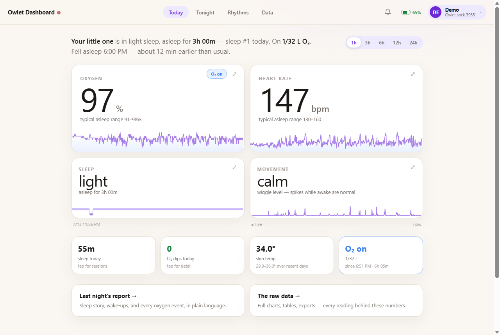
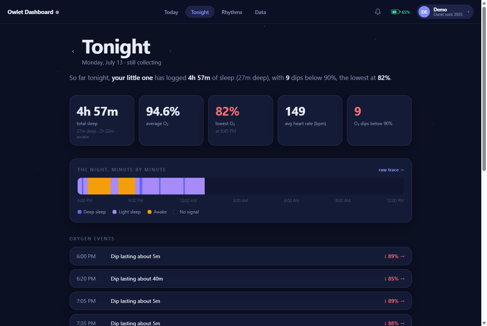
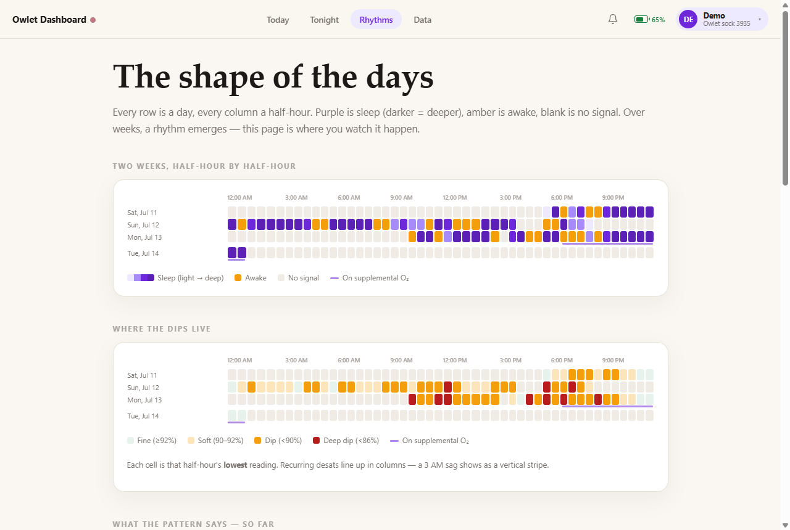
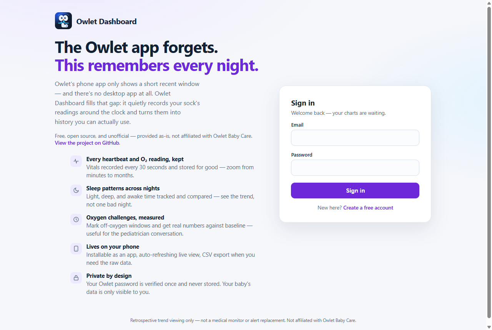

# Owlet Dashboard

The missing Owlet desktop app — an **unofficial**, open-source, provided-as-is history
collector and dashboard for Owlet Dream Sock / Smart Sock data. Not affiliated with or
endorsed by Owlet Baby Care.

Owlet Dashboard stores local historical vitals from the unofficial Owlet cloud API and shows oxygen, heart-rate, movement, and sleep/wake trends in a private web dashboard. It is designed for parents who want retrospective history beyond the short recent window shown in the Owlet app.

The Owlet app only exposes a short recent window. This server polls Owlet's unofficial cloud API via [`pyowletapi`](https://pypi.org/project/pyowletapi/), stores readings locally, and serves a simple historical dashboard.

> Safety note: this is for retrospective trend viewing only. Do **not** use it as a medical alerting system or as a replacement for the Owlet app/base station.

## Screenshots

**Today** — live vitals with personal baselines, touch/drag/zoom charts, sleep at a glance,
and one-tap supplemental-O₂ logging:



| **Tonight** — the narrative night report | **Rhythms** — the pattern reader |
| --- | --- |
|  |  |

The landing page, for the curious:



## What it stores

Each poll stores:

- timestamp
- device serial
- heart rate
- oxygen saturation / SpO₂
- movement
- sleep state, when available
- battery
- skin temperature, when available
- raw normalized payload for future fields

## Run with Docker (recommended)

```bash
docker run -d --name owlet-dashboard \
  -p 8888:8888 \
  -v /path/to/appdata/owlet-dashboard:/data \
  docker.io/pbozzay/owlet-dashboard:latest
```

Images are published to Docker Hub (`pbozzay/owlet-dashboard`, versioned on every
`v*.*.*` tag) and to GHCR (`ghcr.io/pbozzay/owlet-dashboard:latest`, on every push
to main).

Put your reverse proxy (nginx, Nginx Proxy Manager, ...) in front of port 8888 with
HTTPS; the app trusts `X-Forwarded-*` headers. On Unraid: add a container using the
GHCR image, map `/data` to an appdata share, map the port.

Open the site, create an account (the first signup adopts any data from a
pre-multi-user database), and link your Owlet login on the onboarding page. Owlet
passwords are verified once with Owlet and never stored — only access tokens.
Region options: `world` (typical US/global account) or `europe` (EU account).

## Desktop app (Windows)

A Tauri-based installable Windows app lives in [`desktop/`](desktop/README.md): the same
server frozen into a sidecar exe (data in `%LOCALAPPDATA%\owlet-dashboard`), wrapped in a
native window with an `admin`/`password` local login.

> **Know its limitation:** the desktop app only collects readings **while it is running**
> (or while your PC is awake). Owlet's API cannot backfill, so time offline is lost
> permanently and shows up as "collector off" gaps in the charts. For gapless 24/7
> history, run the Docker version on an always-on machine and use the desktop app or a
> browser as the viewer.

## Local development

```bash
python -m venv .venv
.venv/Scripts/python -m pip install -e ".[dev]"   # .venv/bin/... on mac/linux
.venv/Scripts/python -m uvicorn app.main:app --host 127.0.0.1 --port 8888
```

Open:

- Sign in / sign up: <http://127.0.0.1:8888/>
- Health: <http://127.0.0.1:8888/api/health>
- All readings JSON (session required): <http://127.0.0.1:8888/api/readings>
- Recent readings JSON: <http://127.0.0.1:8888/api/readings?hours=24>
- Summary JSON: <http://127.0.0.1:8888/api/summary>

Dashboard features:

- installable PWA shell with manifest, icons, service worker, and an in-app install button
- live auto-refresh every 15 seconds with the countdown folded into the Refresh button
- first-load overlay that shows progress while readings load and charts draw, so the dashboard does not feel frozen during startup
- primary full-width vitals trace with synchronized drag/pan/zoom, plus a dotted red 85% SpO₂ reference line for spotting deeper drops
- top-bar device selector with `device=<serial>` URL filtering, compact mobile sock labels, and a one-row mobile control strip with live pulse, notification badge, O₂ challenge shortcut, battery, and refresh icon
- range, smoothing, overlay toggles, and export inside a single grouped main graph toolbar; raw points are the default, and smoothed lines keep offline/no-signal points at zero without letting them contribute to averages
- mobile defaults to a 6-hour range and uses direct horizontal touch-drag panning on time-series charts; desktop drag-select still zooms
- compact `O₂+` menu in the main graph header for creating oxygen challenges from the current graph window or manually entered times
- at-a-glance sleep card shows the current sleep/wake state with duration, while retaining 24h light/deep/awake totals underneath
- oxygen challenge tracking for marked off-oxygen windows, shown as blue chart bands and excluded from normal averages/stats
- mobile-safe oxygen challenge modal with an explicit Add new O₂ challenge form, editable start/end times, notes, delete action, per-challenge duration, avg/min O₂, avg HR, low/critical O₂ samples, sleep/awake time, and same-length prior-window comparison
- compact sleep/wake accessory strip directly under the main vitals trace with aligned time labels, time-based hover mapping, and hover-highlighted sleep-phase bands on the main chart
- optional full-height sleep/wake highlights on the main chart, with exact state windows or a "guess sleep windows" mode
- ballpark sleep/wake highlights exclude exact disconnected/no-signal spans and treat meaningful movement bursts as awake evidence
- compact O₂ trend companion chart inside the main vitals card, calculated after the primary dashboard renders, using a MACD-style 30m average vs 4h baseline signal with darker, thicker red/green bars and visible gaps across offline/missing-data periods
- synchronized horizontal time scrollbar for panning the visible window across all aligned charts, with extra history loaded behind the default range, lazy older-history loading near the left edge, and refreshes that preserve the current zoom/pan window unless the scrollbar is already at the latest edge
- grey disconnected/offline bands when Owlet reports zero-valued vitals or explicit sock disconnected/off flags, including stale nonzero vitals held during disconnects
- offline/no-signal readings are zeroed in the dashboard trace/table, kept in raw payloads for debugging, and excluded from averages, trends, and sleep analysis
- Owlet alert/notification capture for low oxygen, sock disconnect/off, heart-rate, battery, and base-power alerts emitted by Owlet/API data; measured SpO₂ dips are shown in stats/challenges/graphs but do not create notification-pane alerts
- BTC/ETH/XMR price glance powered by CoinGecko, plus an optional hidden-by-default BTC price overlay on the main vitals chart
- "today at a glance" latest vitals card plus top-bar battery indicator with percent and remaining-time tooltip when available
- breathing trend card comparing recent vs prior oxygen averages
- sleep/awake estimate using Owlet sleep-state codes (`1=awake`, `8=light sleep`, `15=deep sleep`)
- 5m/15m/30m/1h/6h/12h/daily drill-down averages for oxygen, HR, sleep, and awake time
- compact mobile layout with true fixed modals for notifications and oxygen challenges
- click a row to inspect that normalized reading
- CSV download for the current filtered view

Analytics endpoints:

- Insights: <http://127.0.0.1:8888/api/insights?hours=24>
- Hourly rollups: <http://127.0.0.1:8888/api/rollups?bucket=hour&hours=24>
- Daily rollups: <http://127.0.0.1:8888/api/rollups?bucket=day&hours=168>
- Notifications: <http://127.0.0.1:8888/api/notifications?hours=24>
- Oxygen challenges: <http://127.0.0.1:8888/api/oxygen-challenges?hours=24>
- Compact widget JSON: <http://127.0.0.1:8888/api/widget?hours=24>

The same compact widget payload is available on the tokenized share path at `/share/<token>/api/widget?hours=24`. iOS PWAs cannot create native Home Screen or Lock Screen widgets, but apps like Widgy or Scriptable can poll this JSON URL for a private glanceable widget.

## Internet access

Any HTTPS reverse proxy works; every page requires sign-in, so exposure is gated by
the app's own auth. Deployment notes live in [`docs/deployment.md`](docs/deployment.md).

## Run tests

```bash
.venv/Scripts/python -m pytest -q   # .venv/bin/... on mac/linux
```

## Built with

Credit to the open-source libraries this project stands on:

- [FastAPI](https://fastapi.tiangolo.com/) + [Uvicorn](https://www.uvicorn.org/) — web framework and ASGI server
- [pyowletapi](https://pypi.org/project/pyowletapi/) — unofficial Owlet cloud client
- [aiosqlite](https://github.com/omnilib/aiosqlite) — async SQLite storage
- [Pydantic](https://docs.pydantic.dev/) + [pydantic-settings](https://docs.pydantic.dev/latest/concepts/pydantic_settings/) — models and configuration
- [Chart.js](https://www.chartjs.org/) + [chartjs-plugin-zoom](https://www.chartjs.org/chartjs-plugin-zoom/latest/) + [Hammer.js](https://hammerjs.github.io/) — charts with drag/pan/zoom
- [argon2-cffi](https://argon2-cffi.readthedocs.io/) — password hashing
- [pytest](https://docs.pytest.org/) + [HTTPX](https://www.python-httpx.org/) + [Ruff](https://docs.astral.sh/ruff/) — tests and linting

## Notes on Owlet API fragility

Owlet has no documented public API for this. This project intentionally isolates the unofficial dependency in `app/owlet_client.py`, so if Owlet changes auth/endpoints, the storage/API/dashboard should remain intact and only the adapter should need updates.

Libraries I checked while scaffolding:

- `pyowletapi` — current PyPI package, used here.
- `jlamendo/ha-sensor.owlet` — Home Assistant integration using the modern API.
- `hmostafa17/owlet-dream-logger` — real-time logger/dashboard with more aggressive reconnect logic.
- `edfincham/owlet-sock-scraper` — Go + Postgres + Grafana approach.

## Next improvements

- Web Push for low-O₂ alerts on phones (works on iOS 16.4+ when the app is
  added to the Home Screen as a PWA): a service-worker push handler, push
  subscriptions stored per device, and the server sending a signed push
  (VAPID) when the poller writes a low-O₂ alert. Very buildable on top of
  what exists — the alert already creates a server-side notification row, so
  it's "send a push at that moment" plus a subscribe button.
- Retention/downsampling job so cold rollup computes stay fast as readings grow.
- Add daily sleep rollups in a `sessions` table.
- Add CSV export endpoint.
- Add Grafana/Prometheus option if you want more powerful charts.
